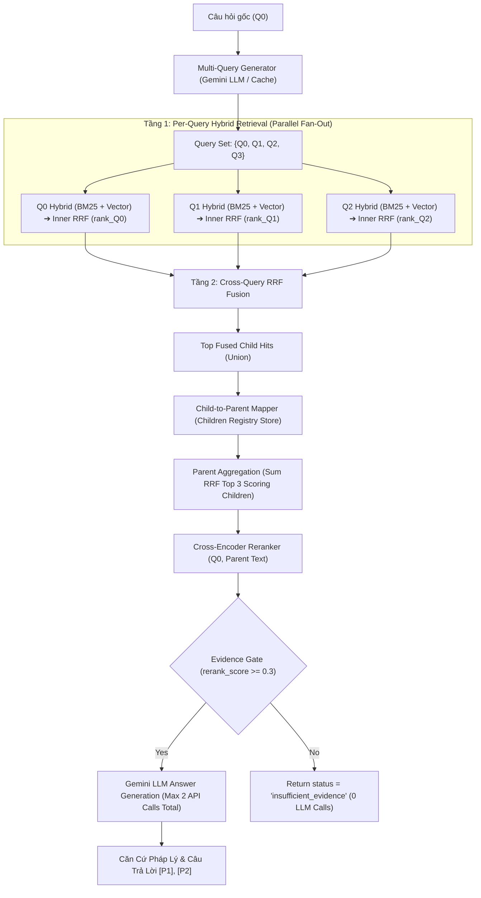

# RAG Foundation — Buổi 09: Multi-query & Parent–Child Retrieval

Hệ thống RAG nâng cao chuyên dụng cho **Văn bản Quy phạm Pháp luật Ngân hàng Nhà nước Việt Nam**, kết hợp kỹ thuật **Multi-Query Expansion (Fan-Out)**, **Hai Tầng RRF Fusion (Inner RRF & Cross-Query RRF)** và chiến lược **Parent–Child Hierarchical Retrieval ("Retrieve Child, Return Parent")**.

---

## 📌 1. Mục Tiêu & Sự Khác Biệt Buổi 08 vs. Buổi 09

| Tiêu Chí | Buổi 08 (Advanced RAG Baseline) | Buổi 09 (Multi-Query Parent–Child RAG) |
| :--- | :--- | :--- |
| **Đơn vị Lưu trữ & Tìm kiếm** | Flat Chunk độc lập (300-800 ký tự) | Cấu trúc phân cấp 2 tầng: **Child Chunk** & **Parent Document** |
| **Số lượng Query Đầu vào** | 1 Query gốc ($Q_0$) duy nhất | Multi-Query Set ($Q_0 + Q_1..Q_n$) fan-out đa khía cạnh |
| **Chiến lược Fusion** | 1 Tầng Inner Hybrid RRF (BM25 + Semantic) | **2 Tầng Fusion**: Inner Hybrid RRF + Cross-Query RRF giữa các câu hỏi |
| **Đơn vị Ngữ cảnh Trả về** | Trả về các Child Chunk cắt nhỏ | **Mở rộng sang Parent Document** chứa đầy đủ Điều/Khoản ngữ cảnh |
| **Tầng Cross-Encoder Rerank** | Rerank các Child Chunks đơn lẻ | **Rerank danh sách Parent Documents** bằng $Q_0$ |
| **Khả năng Giải thích (Explainability)** | Chỉ có điểm số tương quan đơn lẻ | Ma trận Query–Child và Cây ánh xạ Parent ──► Child ──► Queries |

---

## 📐 2. Sơ Đồ Kiến Trúc Pipeline 2 Tầng Fusion & Parent Expansion



---

## 🔀 3. Ma Trận 4 Chế Độ Truy Vấn (4 Mode Comparison Matrix)

1. **`single_flat`**: $Q_0$ ➔ Hybrid Retrieval ➔ Rerank Child Chunks bằng $Q_0$ (Baseline Buổi 08).
2. **`multi_flat`**: $Q_0 + Q_1..Q_n$ ➔ Per-Query Hybrid Fan-Out ➔ Cross-Query RRF ➔ Rerank Child Chunks bằng $Q_0$.
3. **`single_parent`**: $Q_0$ ➔ Hybrid Retrieval ➔ Child-to-Parent ➔ Parent Aggregation ➔ Rerank Parent Documents bằng $Q_0$.
4. **`multi_parent`**: $Q_0 + Q_1..Q_n$ ➔ Per-Query Hybrid Fan-Out ➔ Cross-Query RRF ➔ Child-to-Parent ➔ Parent Aggregation ➔ Rerank Parent Documents bằng $Q_0$.

---

## 📁 4. Cấu Trúc Project & Hướng Dẫn Thiết Lập `.env`

### Cấu trúc Thư mục:
```text
rag_advanced/buoi_09/
├── .env.example
├── .gitignore
├── requirements.txt
├── rag.py
├── advanced_rag.py
├── hierarchical_rag.py
├── evaluate.py
├── app.py
├── README.md
├── SPEC_buoi_09.md
├── eval/
│   └── questions.json
├── reports/
│   └── .gitkeep
├── storage/
│   ├── chroma/
│   ├── hierarchy/
│   │   ├── children.json
│   │   ├── parents.json
│   │   └── manifest.json
│   └── huggingface/
└── tests/
    ├── __init__.py
    ├── test_hierarchy.py
    ├── test_multi_query.py
    ├── test_multi_retrieval.py
    ├── test_parent_retrieval.py
    ├── test_answer_pipeline.py
    ├── test_ui.py
    └── test_evaluator.py
```

### Cấu hình `.env`:
Tạo file `.env` theo `Path(__file__).resolve().parent`:
```env
GEMINI_API_KEY=AIzaSy...
GEMINI_EMBEDDING_MODEL=gemini-embedding-2
GEMINI_GENERATION_MODEL=gemini-2.5-flash
RERANKER_MODEL=BAAI/bge-reranker-v2-m3
```

---

## 🧱 5. Xây Dựng Hierarchy Store & Giải Thích Warning / Ambiguity

Khởi tạo phân cấp 2 tầng từ tập dữ liệu gốc 99 chunks thuộc 3 Thông tư (TT 39/2016, TT 06/2023, TT 02/2023):
```bash
python hierarchical_rag.py build-hierarchy
```
- **Thống kê Registry**: 99 Children ➔ 57 Parents.
- **Quy tắc Phân Phối**: Mỗi Child được ánh xạ đúng 1 Parent độc nhất.
- **Xử lý Xung Đột (Ambiguity)**: Các đoạn văn bản sửa đổi/bổ sung (ví dụ Điều 1 Thông tư 06/2023 sửa đổi Điều 8 Thông tư 39/2016) được đánh dấu `ambiguous = True` kèm cảnh báo `warnings` nổi bật.

---

## 🤖 6. Quy Tắc Multi-Query Expansion & Ngân Sách API Call

- **Ngân sách Generation API**: Tối đa **2 lần gọi API** cho 1 lượt hỏi đáp `multi_parent` hoàn chỉnh:
  - **Lần 1**: Multi-Query Expansion (Sinh tối đa `MULTI_QUERY_COUNT` câu hỏi biến thể).
  - **Lần 2**: Answer Generation LLM.
- **Cơ chế Cache**: Tránh gọi trùng lặp Gemini API cho cùng 1 câu hỏi đầu vào.
- **Chế độ Fallback**: Nếu sinh query bị lỗi/vượt hạn mức quota, hệ thống tự động trả cảnh báo và fallback chạy bằng $Q_0$.

---

## 🧮 7. Công Thức Toán Học Hai Tầng RRF & Parent Aggregation

### 1. Tầng 1: Inner Hybrid RRF (Per Query)
$$rank_q(d) \text{ được tính từ BM25 Rank } + \text{ Vector Semantic Rank}$$

### 2. Tầng 2: Cross-Query RRF Fusion
$$\text{multi\_query\_rrf\_score}(d) = \sum_{q \in Q} \frac{w_q}{60 + rank_q(d)}$$
- Trọng số $w_{Q0} = 1.5$ (Original Query)
- Trọng số $w_{variant} = 1.0$ (Generated Query)

### 3. Tầng 3: Parent RRF Aggregation
$$\text{parent\_rrf\_score}(p) = \sum_{c \in \text{Top 3 Scoring Children}} \frac{1}{60 + rank_{multi\_query}(c)}$$

---

## 🎯 8. Quy Trình "Retrieve Child, Return Parent" & Parent Reranking

1. Tìm kiếm và chọn lọc các Child Chunks nhỏ, cô đọng.
2. Tra cứu `parent_id` từ registry `children.json`.
3. Load văn bản gốc đầy đủ `parent_text` từ `parents.json` (không tóm tắt bằng LLM).
4. Ghép cặp Cross-Encoder: `(Q0, parent_text)` với $Q_0$ là câu hỏi gốc.
5. Chấm điểm Sigmoid score: $parent\_rerank\_score = \frac{1}{1 + e^{-logit}} \in [0, 1]$.
6. Lọc bằng chứng qua cổng Evidence Gate `parent_rerank_score >= RERANK_MIN_SCORE` (0.3).

---

## 💻 9. Hướng Dẫn Các Lệnh CLI & Streamlit UI

```bash
# 1. Chẩn đoán trạng thái Hierarchy Registry Store
python hierarchical_rag.py hierarchy-status

# 2. Xây dựng lại Hierarchy Registry Store
python hierarchical_rag.py build-hierarchy

# 3. Sinh biến thể Multi-Query
python hierarchical_rag.py expand-query --question "Điều kiện vay vốn là gì?"

# 4. Truy vấn Child Hits
python hierarchical_rag.py multi-child --question "Điều kiện vay vốn là gì?"

# 5. Truy vấn Parent Candidates
python hierarchical_rag.py parent-retrieve --mode multi_parent --question "Điều kiện vay vốn là gì?"

# 6. Chạy RAG hoàn chỉnh sinh câu trả lời
python hierarchical_rag.py query --mode multi_parent --question "Điều kiện vay vốn là gì?"

# 7. So sánh 4 Modes (Retrieval-Only, 0 LLM Answer Calls)
python hierarchical_rag.py compare --question "Điều kiện vay vốn là gì?"

# 8. Chạy đánh giá Benchmark Offline
python evaluate.py

# 9. Chạy ứng dụng Streamlit UI
python -m streamlit run app.py
```

---

## 📊 10. Giải Thích Các Tham Số Cấu Hình chính

- `PER_QUERY_CANDIDATES` (20): Số lượng ứng viên Child chọn ra cho mỗi Query.
- `PARENT_CANDIDATES` (10): Số lượng Parent tối đa đưa vào tầng Cross-Encoder Reranker.
- `FINAL_PARENT_TOP_K` (5): Số lượng Parent giữ lại sau Rerank.
- `TOTAL_CONTEXT_MAX_CHARS` (12,000): Ngân sách tối đa ký tự ngữ cảnh đưa vào Prompt LLM.
- `RERANK_MIN_SCORE` (0.30): Ngân sách cổng kiểm duyệt bằng chứng tối thiểu.

---

## 📈 11. Đánh Giá Chất Lượng (Evaluation Metrics & Gold Labels)

- Bộ chỉ số đo lường: **Child Recall@K**, **Parent Recall@K**, **MRR@K**, **nDCG@K**.
- **Cảnh báo Giới hạn Nhãn**: Do tập dữ liệu Gold Labels chứa các nhãn `needs_human_review = True`, các chỉ số đánh giá mang tính chất benchmark kỹ thuật đối sánh giữa 4 modes, không tuyên bố tuyệt đối mode thắng nếu chưa được duyệt bởi chuyên gia pháp lý.

---

## 🛠️ 12. Troubleshooting & Xử Lý Lỗi Thường Gặp

- **Lỗi `hierarchy_not_ready`**: Chạy lệnh `python hierarchical_rag.py build-hierarchy`.
- **Lỗi `collection_not_ready`**: Chạy lệnh `python advanced_rag.py prepare-semantic`.
- **Lỗi `RESOURCE_EXHAUSTED 429` (Gemini API)**: Đợi 30-60s hết rate limit hoặc kiểm tra Quota hạn mức API Key.
- **Lỗi Reranker GPU OOM**: Tự động fallback chạy trên CPU (`RERANK_DEVICE=cpu`).

---

## ⚖️ 13. Tuyên Bố Trách Nhiệm (Legal Disclaimer)

> **CẢNH BÁO PHÁP LÝ**: Hệ thống RAG này được xây dựng cho mục đích nghiên cứu và thực hành kỹ thuật công nghệ RAG Advanced. Kết quả sinh ra bởi hệ thống **KHÔNG PHẢI VÀ KHÔNG ĐƯỢC DÙNG THAY THẾ TƯ VẤN PHÁP LÝ CHÍNH THỨC** của Ngân hàng Nhà nước Việt Nam hoặc các cơ quan tài chính thẩm quyền.
