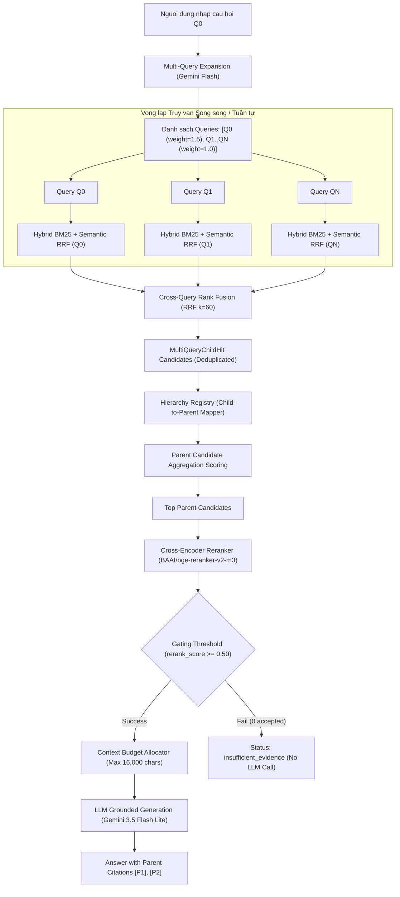

# ĐẶC TẢ KỸ THUẬT ADVANCED RAG (BUỔI 09)
## Multi-Query Expansion, Parent-Child Hierarchical Retrieval & Aggregated Reranking

---

## 1. Mục Tiêu & Khác Biệt Giữa Buổi 08 Và Buổi 09

### a. Mục Tiêu
Buổi 09 mở rộng kiến trúc RAG Nâng Cao từ Buổi 08 bằng cách giải quyết 2 bài toán cốt lõi trong thực tế RAG Pháp Lý:
1. **Bài toán Từ vựng / Diễn đạt (Vocabulary Mismatch)**: Người dùng hỏi 1 câu bằng từ ngữ tự nhiên ($Q_0$), nhưng văn bản pháp luật dùng thuật ngữ hành chính chuyên ngành. **Multi-Query Expansion** sinh ra $N$ biến thể câu hỏi ($Q_1, Q_2, \dots, Q_N$) để quét sạch mọi góc độ từ vựng.
2. **Bài toán Ngữ cảnh Bị Xé Lẻ (Fragmented Context)**: Tìm kiếm theo Chunk nhỏ (Child Chunk) giúp tìm chính xác điểm phạt/khoản mục, nhưng làm mất bức tranh tổng thể của cả Điều/Chương. **Parent-Child Hierarchical Retrieval** tìm kiếm trên Child Chunks nhưng tổng hợp và trả về nguyên **Parent Document** (toàn bộ Điều văn bản) cho LLM đọc.

### b. Khác Biệt So Với Buổi 08
| Tiêu Chí | Buổi 08 (Hybrid & Rerank Flat) | Buổi 09 (Multi-Query & Parent-Child) |
|---|---|---|
| **Query Input** | Đơn câu hỏi $Q_0$ duy nhất | Đơn câu hỏi $Q_0$ + $N$ biến thể ($Q_1, \dots, Q_N$) sinh tự động |
| **Retrieval Unit** | Flat Chunks độc lập | Child Chunks ➔ Map sang Parent Documents |
| **Rank Fusion** | RRF giữa 2 nhánh (BM25 + Semantic) | RRF 2 cấp: (1) Per-query RRF ➔ (2) Cross-Query RRF |
| **Score Aggregation** | Rerank trực tiếp từng Flat Chunk | Tổng hợp điểm Child hits sang điểm Parent Candidate |
| **Reranking Target** | Cross-Encoder Rerank trên Top Flat Chunks | Cross-Encoder Rerank trên Top Parent Documents |
| **Citation Format** | Marker theo Chunk `[E1]`, `[E2]` | Marker theo Parent Document `[P1]`, `[P2]` |

---

## 2. Sơ Đồ Kiến Trúc Luồng Dữ Liệu (Pipeline Flow Chart)



---

## 3. Bốn Chế Độ Truy Vấn (Retrieval Modes)

1. **`single_flat`**: 1 Query nguyên bản ($Q_0$) ➔ Hybrid RRF ➔ Rerank trên Flat Chunks (Baseline Buổi 08).
2. **`multi_flat`**: Multi-Query Expansion ($Q_0 + Q_1..Q_N$) ➔ Per-query Hybrid ➔ Cross-query RRF ➔ Rerank trên Flat Chunks.
3. **`single_parent`**: 1 Query nguyên bản ($Q_0$) ➔ Hybrid RRF ➔ Child-to-Parent Mapping ➔ Rerank trên Parent Documents.
4. **`multi_parent`**: Multi-Query Expansion ($Q_0 + Q_1..Q_N$) ➔ Cross-Query RRF ➔ Child-to-Parent Aggregation ➔ Rerank trên Parent Documents (Chế độ Nâng cao nhất).

---

## 4. QueryVariant Schema & Validation Rules

### Schema:
```json
{
  "query_id": "Q1",
  "text": "Điều kiện để ngân hàng cơ cấu lại thời hạn trả nợ cho khách hàng?",
  "weight": 1.0,
  "is_original": false
}
```

### Validation Rules:
1. $Q_0$ luôn có `is_original = True`, `weight = 1.5`, `query_id = "Q0"`.
2. Các biến thể $Q_1..Q_N$ có `is_original = False`, `weight = 1.0`.
3. `text` không được rỗng, không được trùng lặp 100% với $Q_0$ sau khi trim whitespace.
4. Độ dài `text` của biến thể tối đa `MULTI_QUERY_MAX_CHARS` (300 ký tự).
5. Nếu LLM gặp lỗi khi sinh biến thể, hệ thống tự động fallback về danh sách duy nhất `[Q0]` mà không bị sập.

---

## 5. Hierarchy Registry Schema

Chứa bản đồ ánh xạ 2 chiều giữa Child Chunk ID và Parent Document ID:

```json
{
  "parent_id": "TT_02_2023_NHNN.pdf__Dieu_4",
  "source": "TT_02_2023_NHNN.pdf",
  "article_title": "Điều 4. Cơ cấu lại thời hạn trả nợ",
  "full_text": "### Điều 4. Cơ cấu lại thời hạn trả nợ\nTổ chức tín dụng, chi nhánh ngân hàng nước ngoài được xem xét cơ cấu lại thời hạn trả nợ đối với số dư nợ gốc và/hoặc lãi tiền vay khi đáp ứng các điều kiện sau...",
  "child_ids": [
    "TT_02_2023_NHNN.pdf_hierarchical_005",
    "TT_02_2023_NHNN.pdf_hierarchical_006"
  ]
}
```

---

## 6. ParentDocument Schema

Cấu trúc lưu trữ một Parent Document hoàn chỉnh trong bộ nhớ:

```json
{
  "parent_id": "TT_02_2023_NHNN.pdf__Dieu_4",
  "source": "TT_02_2023_NHNN.pdf",
  "article_number": 4,
  "title": "Điều 4. Cơ cấu lại thời hạn trả nợ",
  "text": "...",
  "char_count": 2150,
  "child_count": 2
}
```

---

## 7. MultiQueryChildHit & ParentCandidate Schema

### a. `MultiQueryChildHit`:
```json
{
  "chunk_id": "TT_02_2023_NHNN.pdf_hierarchical_005",
  "parent_id": "TT_02_2023_NHNN.pdf__Dieu_4",
  "text": "...",
  "source": "TT_02_2023_NHNN.pdf",
  "query_hits": {
    "Q0": {"bm25_rank": 1, "semantic_rank": 2, "rrf_score": 0.032},
    "Q1": {"bm25_rank": 3, "semantic_rank": 1, "rrf_score": 0.031}
  },
  "cross_query_rrf_score": 0.063
}
```

### b. `ParentCandidate`:
```json
{
  "parent_id": "TT_02_2023_NHNN.pdf__Dieu_4",
  "source": "TT_02_2023_NHNN.pdf",
  "title": "Điều 4. Cơ cấu lại thời hạn trả nợ",
  "full_text": "...",
  "child_hits": ["TT_02_2023_NHNN.pdf_hierarchical_005"],
  "aggregated_score": 0.085,
  "rerank_score": 0.942,
  "accepted": true
}
```

---

## 8. Quy Tắc Hierarchy Resolution & Ambiguous Warning

1. **Hierarchy Builder Logic**:
   - Quét qua danh sách 99 chunks `hierarchical`.
   - Sử dụng Regex tìm tiêu đề Điều (`## Điều ([0-9]+)\. (.*)`) làm điểm bắt đầu Parent Document.
   - Nhóm các Child Chunks thuộc cùng một Điều vào chung một `parent_id`.
2. **Ambiguous Warning**:
   - Nếu phát hiện văn bản sửa đổi (như Thông tư 06) trích dẫn nhiều Điều bên trong nội dung nhưng không có tiêu đề Điều chính thức ở đầu chunk, hệ thống đưa chunk đó vào Parent mở rộng và gắn cờ `ambiguous_hierarchy = True` trong trace.

---

## 9. Công Thức Cross-Query RRF & Parent Aggregation

### a. Cross-Query RRF (Cho Child Chunk $c$):
$$RRF_{\text{cross}}(c) = \sum_{q \in Q} w_q \times \left( \frac{1}{K + r_{\text{bm25}}(q, c)} + \frac{1}{K + r_{\text{semantic}}(q, c)} \right)$$

Trong đó:
- $w_{Q0} = 1.5$ (Trọng số cao hơn cho câu hỏi gốc)
- $w_{Q1..QN} = 1.0$ (Trọng số cho biến thể)
- $K = 60$

### b. Parent Aggregation Score (Cho Parent $P$):
$$Score(P) = \sum_{c \in \text{Top } M \text{ child hits of } P} RRF_{\text{cross}}(c) \times \left(1 + 0.1 \times (\text{hit\_count} - 1)\right)$$

Trong đó $M = \text{PARENT\_SCORE\_CHILD\_LIMIT} = 3$.

---

## 10. Context Budget & Citation Contract

### a. Context Budget:
- `TOTAL_CONTEXT_MAX_CHARS` = 16,000 ký tự.
- `PARENT_MAX_CHARS` = 6,000 ký tự cho mỗi Parent Document.
- Hệ thống xếp hạng Top Parent Candidates sau Rerank và cộng dồn văn bản cho đến khi chạm hạn ngạch 16,000 ký tự.

### b. Citation Contract:
- Format trích dẫn cho Parent Document: `[P1]`, `[P2]`, ...
- Format trích dẫn cho Flat Chunk (khi ở mode flat): `[C1]`, `[C2]`, ...
- Mỗi trích dẫn phải được map chính xác về `parent_id`, `source`, `article_title` và hiển thị chi tiết trong Evidence Cards.

---

## 11. Status & Failure Contract

Hệ thống cam kết trả về đúng 1 trong các trạng thái sau:
1. **`answered`**: Tìm thấy bằng chứng hợp lệ đạt Rerank Gate và LLM sinh câu trả lời thành công.
2. **`insufficient_evidence`**: 0 Candidate đạt `rerank_score >= 0.50`, LLM Generation **KHÔNG được gọi**.
3. **`retrieval_only`**: Chạy chế độ so sánh retrieval hoặc thiếu Gemini API Key cho LLM generation.
4. **`reranker_unavailable`**: Lỗi nạp mô hình Reranker Cross-Encoder.
5. **`llm_expansion_failed`**: Lỗi sinh biến thể Multi-Query ➔ Tự động fallback về `single_parent` / `single_flat`.

---

## 12. Testability & Dependency Injection

- Tất cả các module phải hỗ trợ Dependency Injection:
  - `genai_client`: Cho phép truyền Client giả/Mock trong unit tests.
  - `reranker_fn`: Cho phép truyền hàm Reranker giả/deterministic trong unit tests.
- **100% Unit Tests phải chạy Offline**, không gọi Internet, không tải model Hugging Face thật và không kết nối Gemini thật.

---

## 13. Evaluation Metrics & Acceptance Criteria

### Metrics:
- **Recall@K / Hit Rate@K**: Tỷ lệ tìm thấy đúng Parent chứa đáp án.
- **MRR@K (Mean Reciprocal Rank)**: Thứ hạng của Parent đúng đầu tiên.
- **nDCG@K**: Độ chính xác sắp xếp thứ hạng có trọng số.
- **Latency Breakdown**: Thời gian thực thi chi tiết cho Expansion, Retrieval, Fusion, Aggregation, Reranking, Generation.

### Acceptance Criteria:
1. Biên dịch py_compile không lỗi.
2. Tất cả Unit Tests Offline PASS 100%.
3. 4 Retrieval Modes chạy đúng hợp đồng Schema.
4. Streamlit UI 4 Tabs hiển thị đầy đủ so sánh và trace.

---

## 14. Xác Nhận Phạm Vi

Đặc tả này áp dụng duy nhất cho thư mục `rag_foundation/buoi_09/` (hoặc `rag_advanced/buoi_09/`), tuyệt đối không sửa đổi mã nguồn của các Buổi 05, 06, 07, 08.
